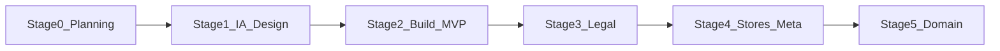

# Vela marketing & compliance website — master plan

**Document:** `vela_website_planning.md`  
**Version:** 1.0  
**Date:** 2026-04-23  
**Purpose:** Single source of truth for building and operating the public Vela website: business goals, context, staged execution with **human gates**, pass/fail criteria, and tests.  
**Hosting:** [Vercel](https://vercel.com/) (preview + production).  
**Initial URL strategy:** Deploy to a `*.vercel.app` hostname first; migrate to a **custom domain** in Stage 5 and update all store/social links.

---

## 1. Business objectives and overall intent

### 1.1 Why this site exists

The Vela website supports **trust, discovery, and compliance** for a crew-focused fatigue and readiness planning product. It must:

1. **Present Vela professionally** to long-haul cabin crew, peer networks, airline-adjacent contacts, and investors — consistent with “By Crew, For Crew” and the pre-seed narrative in the GTM materials.
2. **Provide stable, public HTTPS pages** that app stores and social platforms expect: at minimum **Privacy Policy** and **Terms of Service**, plus **Support / contact** as required by listing flows and reviewer practice.
3. **Speak with one voice** across web, app, and stores: lifestyle and planning positioning; **no** medical-device, diagnostic, or safety-system claims (see regulatory positioning below).
4. **Enable soft conversion**: clear paths to App Store / Google Play (or waitlist) when links are available — without promising features or timelines that the product spec does not support.

### 1.2 What success looks like

| Outcome | Signal |
|--------|--------|
| **Credible brand** | Visual alignment with app design tokens; copy passes regulatory language review |
| **Store-ready URLs** | Privacy + Terms (and Support) load without login; same URLs used in App Store Connect, Play Console, and in-app settings where required |
| **Operational clarity** | Named DRI for URLs/consoles; change process when legal text or domain changes |
| **Low reviewer friction** | Apple/Google checklists satisfied for **web-delivered** legal/support links; Facebook Page website field matches |

### 1.3 Out of scope (for this document)

- Flutter app features, Firebase logic, or backend changes (tracked in the app repo).
- Legal **advice** — counsel should review final Privacy/Terms before high-stakes submission or fundraising; this plan allows a **draft-from-repo** phase first.

---

## 2. Context

### 2.1 Product (summary)

**Vela** is a fatigue and **readiness planning** application for **long-haul cabin crew**, using schedule-based estimates informed by published sleep science (e.g. Three Process Model). It is **not** an airline FRMS component, not a medical device, and not a substitute for fitness-for-duty decisions. Full positioning: see product spec.

### 2.2 Source documents (authoritative references)

These live in the Flutter app repository. **Reference by path;** do not duplicate full legal or product text in this file.

| Topic | Path (app repo) |
|--------|-------------------|
| Product & market specification | `docs/A1_MAIN/VELA_SPECIFICATION.md` |
| GTM / fundraise context | `docs/Financial/20260419_GTM_PLAN.md` |
| **Public language, disclaimers, banned terms** | `docs/Financial/REGULATORY_POSITIONING.md` |
| **Visual design tokens** (colors, typography, radii) | `docs/UIUX/Vela_FlutterFlow_Spec.md` (§ Design Tokens) |
| **Apple App Store** — Privacy/Terms URLs, account deletion, checklists | `docs/A1_MAIN/Vela_Apple_Guidelines.md` |
| Google Play (wellness category, Data safety alignment) | `docs/Financial/REGULATORY_POSITIONING.md` (App Store section includes Play); cross-check [Google Play policy center](https://play.google.com/console/about/guides/releasewithconfidence/) when submitting |

### 2.3 App store & website relationship

- **Apple** and **Google** require **accurate** metadata and, for many apps, **public URLs** for privacy (and often terms/support). The in-repo checklist is `Vela_Apple_Guidelines.md` §6–7; treat it as the engineering checklist for **alignment** between binary, Connect/Console, and web.
- The **website** is the canonical host for those **public** documents (this project’s assumption: **website is the single source of truth** for published legal pages; the app **links** to them).

### 2.4 Meta (Facebook) Page

**Organic Page (default):** Use accurate business/category, **Page Transparency**, and a **website URL** that matches this site. Marketing copy on the Page must follow `REGULATORY_POSITIONING.md` (no banned terms).

**If you add ads, Business Manager, or Meta developer integrations later:** Additional obligations may apply (business verification, data use disclosures, special ad categories). Track as a **separate workstream** and [Meta Business Help](https://www.facebook.com/business/help) for current rules.

### 2.5 Technical context

- **Repository:** `website` (this folder) holds the marketing site implementation; the app remains in `Downloaded FF Files/crew-bid-zh19l5` (or your canonical app path).
- **Stack (implementation):** Next.js on Vercel (App Router), see repository `package.json` and `README.md`.
- **Domains:** Production first on `*.vercel.app`; Stage 5 adds custom DNS and updates all external links.

---

## 3. Execution stages (human gate after each)

Each stage **ends** with a **human gate**: a named approver confirms pass criteria before the next stage starts.

### Stage 0 — Planning baseline (this document)

**Work:** Maintain `vela_website_planning.md`; agree DRIs, stages, and pass/fail.  
**Human gate:** Stakeholders sign **§8 Stage 0 sign-off** below.

### Stage 1 — Information architecture & design

**Work:** Final sitemap; wireframe-level sections for home; extract and apply design tokens from `Vela_FlutterFlow_Spec.md` (cream/ink/gold/night palette, Cormorant Garamond / Outfit / DM Mono); content outline for Privacy, Terms, Support.  
**Human gate:** Approved sitemap + visual direction (e.g. preview or static mock).

### Stage 2 — Build MVP (Vercel preview / `*.vercel.app`)

**Work:** Implement responsive pages: home, Privacy, Terms, Support/Contact; deploy to Vercel; no placeholder lorem on public paths; HTTPS.  
**Human gate:** Internal review on preview URL — **Pass** → promote to production Vercel deployment (still `*.vercel.app` until Stage 5).

### Stage 3 — Legal content

**Work:** Expand draft legal pages from `REGULATORY_POSITIONING.md` and counsel as needed; add last-updated/version footer; optional “draft” banner until review completes.  
**Human gate:** Designated reviewer (or counsel) signs off — or explicit “draft OK for private beta only”.

### Stage 4 — App Store, Play Console, Facebook alignment

**Work:** Enter **production** Privacy/Terms/Support URLs in App Store Connect and Google Play; align in-app Settings links to the **same** URLs per `Vela_Apple_Guidelines.md`; set Facebook Page website; verify no 404s.  
**Human gate:** DRI (see §7) confirms each console and the Page.

### Stage 5 — Custom domain

**Work:** Configure domain at registrar + Vercel; HTTPS; redirect policy from old `vercel.app` if needed; update **all** store and social links.  
**Human gate:** Spot-check links; search engine / redirect sanity (optional: `www` vs apex policy).

**Overlap note:** Stage 3 content drafting can run in parallel with Stage 2; the **legal** gate still controls when marketing calls the site “final.”

---

## 4. Pass/fail criteria by stage

| Stage | Pass | Fail |
|-------|------|------|
| **0** | This doc complete; DRIs named; stakeholders signed §8 | Missing sections; no DRI |
| **1** | Sitemap includes `/`, `/privacy`, `/terms`, `/support` (or equivalent); tokens documented | Missing must-have routes; brand tokens ignored |
| **2** | All public routes HTTP 200 on production; HTTPS; mobile-readable; no lorem | 404/5xx; broken SSL; placeholder text |
| **3** | Disclaimers consistent with `REGULATORY_POSITIONING.md`; dated footer; review status explicit | Banned terms; contradictions with app |
| **4** | Store/Play/Page URLs match live site; in-app links match where required | Any console points to wrong host or 404 |
| **5** | Custom domain works; consoles updated; redirects OK | Mixed content; stale `vercel.app` in production listings |

---

## 5. Tests

### 5.1 Automated (CI / local)

| Test | Purpose |
|------|---------|
| **Build** | `npm run build` succeeds (Next.js) |
| **Lint** | `npm run lint` (if enabled) |
| **Link crawl** | Script or manual crawl: internal links return 200 on preview/prod |
| **Optional: Lighthouse CI** | Accessibility / performance budgets on key pages |

### 5.2 Manual — Apple (website-relevant subset)

From `Vela_Apple_Guidelines.md` §7, verify for **web**:

- Privacy Policy URL (public, loads without login)
- Terms of Service URL (public, loads without login)
- Support URL if used in Connect
- Same URLs reachable from cold browser as pasted in App Store Connect

Re-run when legal text or domain changes.

### 5.3 Manual — Google Play

- Data safety and store listing **point to the same** privacy/support story as the website
- Policy URLs in Play Console match production

### 5.4 Manual — Facebook

- Page **Website** field = production URL
- About/description: no banned terminology (`REGULATORY_POSITIONING.md`)

### 5.5 Copy / compliance pass

- Editorial or grep pass for **banned** terms in `REGULATORY_POSITIONING.md` § Terminology Guide before major launches.

---

## 6. DRIs and RACI (fill in names)

| Area | DRI | Notes |
|------|-----|-------|
| Website product & copy | Iain Giffen | Aligns with GTM |
| Public support (name on `/support`) | Iain Giffen | Set `NEXT_PUBLIC_SUPPORT_EMAIL` in Vercel when the public inbox is ready |
| Legal / Privacy & Terms review | _TBD_ | Draft from repo first |
| App Store Connect URLs | _TBD_ | Paired with iOS build owner |
| Google Play URLs | _TBD_ | Paired with Android build owner |
| Facebook Page | _TBD_ | Often same as marketing |
| Domain & DNS (Stage 5) | _TBD_ | Vercel + registrar |

---

## 7. External checklists (maintain pointers, not copies)

- [Apple App Store Review Guidelines](https://developer.apple.com/app-store/review/guidelines/)
- [Apple — Offering account deletion](https://developer.apple.com/support/offering-account-deletion-in-your-app/) (app behaviour; website must support policy promises)
- [Google Play Developer Policy](https://support.google.com/googleplay/android-developer/answer/9859453)
- [Meta — Business and advertising](https://www.facebook.com/business/help) (if/when ads)

---

## 8. Human gate — Stage 0 sign-off

**Checklist before starting Stage 1 implementation:**

- [x] This planning document read and accepted
- [x] DRIs in §6 assigned (or interim owners)
- [x] Agreed: Vercel + `*.vercel.app` first; custom domain Stage 5
- [x] Agreed: draft legal from repo with later counsel review

| Role | Name | Signature / date |
|------|------|------------------|
| Product / owner | Iain Giffen | Signed 2026-04-23 |
| Technical | | |

---

## 9. Revision history

| Version | Date | Changes |
|---------|------|---------|
| 1.0 | 2026-04-23 | Initial plan: objectives, context, stages 0–5, pass/fail, tests, DRIs |
| 1.1 | 2026-04-23 | §10: Next.js MVP scaffold in this repo; Stages 3–5 remain human/console work |
| 1.2 | 2026-04-23 | §6/§8: Stage 0 signed; support DRI Iain Giffen; `NEXT_PUBLIC_SUPPORT_EMAIL` documented |

## 10. Implementation status (this repository)

- **Code:** Next.js 15 (App Router) + Tailwind, Vercel-ready. See [`README.md`](./README.md) for `npm run dev`, `NEXT_PUBLIC_SITE_URL`, and deploy steps.
- **Routes live:** `/`, `/privacy`, `/terms`, `/support` — draft legal copy; Stage 3 (counsel) before treating as production.
- **Stages 4–5:** Set URLs in App Store Connect, Play Console, Facebook; then custom domain and env update.
